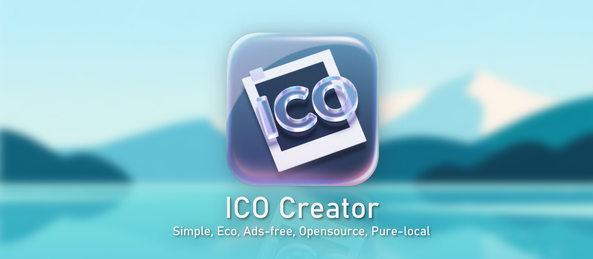

# ICO Creator
从图片创建ICO图标文件.
Create ICO icon file from various type of images.

无广告，不联网，纯本地。

# 使用方法

从发行版页面下载exe，双击即可运行。

将需要处理的图片拖拽入对话窗口，或复制粘贴，或键入图片存储路径，回车即可制作导出ico

# 特性
- 尺寸全覆盖，默认生成多种系统兼容尺寸的ico，包括`16,24,32,48,64,96,128,160,256,512,1024`分辨率，无需手动查询所需尺寸。
- 支持交互式补全，运行时会主动询问缺失的参数。
- 支持命令行精细控制参数：

```
usage: ico-creator.exe [-h] [--image IMAGE] [--out OUT] [--pixels [PIXELS ...]]

options:
  -h, --help            show this help message and exit
  --image IMAGE         input image path
  --out OUT             ico output position
  --pixels [PIXELS ...], -p [PIXELS ...]
                        default resolutions: [16, 24, 32, 48, 64, 96, 128, 160, 256, 512, 1024]
```

使用举例：

```bash
ico-creator.exe --pixels 32 64 96
ico-creator.exe --image xxx.png --pixels 32 64 96
ico-creator.exe --image xxx.png --out yyy.ico --pixels 32 64 96
```
